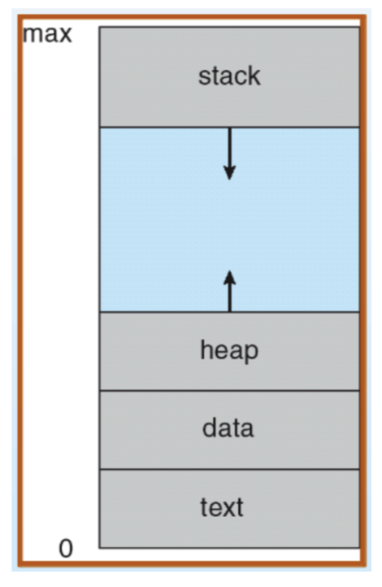
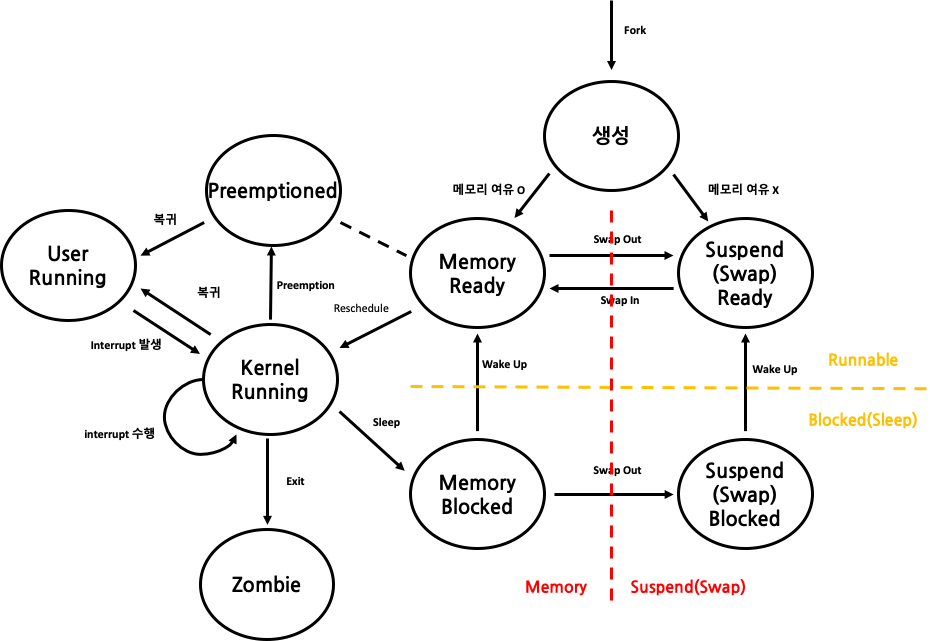

# 프로세스

### 프로세스 개념
- 실행중인 프로그램

#### process vs program

program 👉🏻 disk에 위치
process 👉🏻 memory에 위치

process는 디스크에 위치한 pocess file을 memory에 올리는 것이다. 이때, 프로그램 파일 전체를 메모리 상에 올리수도 일부분에 올릴 수도 있다. 
👉🏻 정리하자면 A Program in Execution이 **Process** 이다. 

### Process의 구성
process는 위에서 확인한 것과 같이 memory상에 위치한다. 구체적으로 보자면 Stack, Heap, Data, Text(Code) 등의 영역으로 구분된다.

프로세스는 메모리를 할당 받아 그 안에서 자신만의 가상 주소 체계를 갖춘다. 
process의 가상 주소 0번지는 Stack의 처음이고, 가상 주소의 가장 끝은 Text의 끝이다.

- Stack : 함수 호출과 context switch에 사용된다. 
       함수를 호출할 때에는 parameter, return address, local 변수 등을 저장한다.
       context switch가 일어날 때에는 PC, stack pointer 등의 register 값을 저장한다.
- Heap section : 동적 메모리 할당(dynamic allocation)을 위한 메모리 공간이다. 동적으로 할당된 메모리 공간들이 heap에 저장된다.
- Data section : static, global 변수들이 저장되는 공간이다.
- Text section : 프로그램 코드가 저장되는 공간이다.

참고로  heap, stack 사이의 gap이 있는 이유 stack과 heap의 크기가 동적으로 변화하기 때문이다!

- 주소공간(address space)

운영체제가 실행중인 프로그램에서 제공하는 명령어 및 사용중인 데이터들이 저장되는 메모리 공간
메모리 가상화를 통해 할당받은 가상 메모리

- 레지스터

프로그램 실행에 필요한 메타데이터 저장 공간
예시:
•	Program Counter (PC): 현재 실행 중인 명령어 다음 주소를 가리키는 레지스터
•	Stack Pointer (SP): 현재 함수 호출에서 사용되는 변수들이 저장되는 스택 최상단 주소를 가리키는 레지스터

### Process 동시 실행

운영체제는 시분할 기법(Time Sharing)을 통해 CPU를 가상화하여 여러 프로세스가 동시에 실행되는 것처럼 보이게 한다.

---

#### 시분할(Time Sharing)이란

- 대표적으로 Round Robin 방식의 프로세스 스케줄링 기법을 사용한다.
- 여러 프로세스를 일정 시간(Time Quantum) 단위로 번갈아 실행시켜 사용자 입장에서는 동시에 작업이 수행되는 것처럼 보이게 한다.

---

#### 시분할의 한계

- 동시에 실행되는 프로세스 수가 많아질수록 하나의 프로세스에 할당되는 CPU 시간이 줄어든다.
- 이로 인해 Context Switching(프로세스 상태 저장 및 복원) 횟수가 많아져 오버헤드가 증가한다.
- 결과적으로 전체 시스템 성능이 저하될 수 있다.

---

#### 공간분할(Space Sharing)과의 비교

- 공간분할은 CPU가 아닌 디스크, 메모리 등의 물리 자원을 공간 단위로 나누어 여러 프로세스에 동시에 할당하는 방식이다.
- 예: 메모리를 여러 영역으로 나누어 각 프로세스가 고정된 공간을 사용하는 구조

---

### 비교하자면,,,

| 구분 | 설명 |
|------|------|
| 시분할(Time Sharing) | CPU 자원을 시간 단위로 나누어 여러 프로세스에 순차적으로 할당. 실제 병렬은 아니지만 동시성 제공 |
| 공간분할(Space Sharing) | 메모리나 디스크 자원을 공간 단위로 나누어 여러 프로세스에 동시에 할당 |

### 프로세스 생성

운영체제는 `fork()`와 같은 시스템 콜(System Call)을 통해 새로운 프로세스를 생성할 수 있다.  
프로세스를 생성한다는 것은 프로그램을 메모리로 로드(load)하여 실행 가능한 상태로 만드는 작업이다.

보다 정확히 말하면, 프로그램을 **해당 프로세스의 가상 주소 공간 안으로 로드**하는 것이다.

---

#### 메모리 로드 방식

- 디스크와의 I/O는 시간이 많이 소요되기 때문에, 모든 코드를 한 번에 로드하지 않는다.
- 대신, **가장 먼저 필요한 일부분만 우선적으로 로드**하고,
- 이후 실행 도중 필요한 코드나 데이터를 **페이지 단위로 나누어 점진적으로 로드**한다.

---

#### 메모리 구조별 역할

- **Stack**:  
  지역 변수, 함수 매개변수, 반환 주소 등이 저장된다.

- **Heap**:  
  `malloc()`, `free()` 등을 통한 **동적 메모리 할당**이 이루어지는 공간이다.

---

#### 초기화 과정

프로세스 생성 이후, 운영체제는 다음과 같은 초기화 작업을 수행한다:

- 표준 입출력(표준 파일 디스크립터: stdin, stdout, stderr) 설정
- 기타 I/O 설정 등

---

#### 실행 시작

- 프로세스가 생성되면 운영체제는 진입점인 `main()` 함수의 위치를 찾아낸다.
- 이후, **운영체제로부터 CPU의 제어권이 해당 프로세스로 넘어가며 실행이 시작**된다.

### 프로세스 상태(Process State)

운영체제는 한 번에 하나의 프로세스만 CPU에서 실행할 수 있기 때문에,  
여러 프로세스를 동시에 운용하려면 각각의 상태를 정의하고 전환해가며 관리해야 한다.

CPU는 `dispatcher`라는 전환기를 통해 프로세스들을 매우 짧은 시간 간격으로 번갈아 실행하며,  
그에 따라 프로세스는 여러 상태를 가지게 된다.

---

### 1. 두 가지 상태 (2-State Model)

- **Running**:  
  프로세스가 실제로 CPU에서 실행 중인 상태  
  → 메모리에 로드되어 있으며, 현재 CPU를 점유 중

- **Not Running**:  
  실행 중이 아닌 상태 (대기 중인 모든 상태 포함)  
  → 메모리에 있을 수는 있지만 CPU를 점유하지 않음

- CPU는 한 번에 하나의 프로세스만 실행할 수 있기 때문에, 나머지 모든 프로세스는 `Not Running` 상태가 된다.
- `Time Quantum`이 만료되거나 I/O 요청 등의 이유로 문맥 전환이 발생하면 다른 프로세스가 실행되고,  
  기존 프로세스는 다시 `Not Running` 상태가 된다.

---

### 2. 세 가지 상태 (3-State Model)

- **Running**: 현재 CPU에서 실행 중
- **Ready**: 실행 준비가 완료된 상태. CPU만 할당되면 즉시 실행 가능
- **Blocked**: I/O 등의 작업으로 대기 중인 상태

| 상태 | 설명 |
|------|------|
| Running | CPU를 점유하여 실행 중 |
| Ready | 실행 조건은 만족하지만, CPU를 아직 할당받지 못한 상태 |
| Blocked | 디스크 I/O 등으로 대기 중. CPU는 점유하지 않음 |

- Blocked 상태는 흔히 "잠든 상태(Sleep)"로 표현되며,  
  예: 디스크 I/O 도중에는 디스크 인터페이스(SATA 등)가 작업을 수행하고 CPU는 별다른 작업을 하지 않음
- Blocked 상태는 언제든 다른 프로세스에게 CPU 점유를 빼앗길 수 있음 (Preemption)

---

### 3. 다섯 가지 상태 (5-State Model)

기존 3가지 상태에 **생성(New)** 과 **종료(Terminated)** 상태가 추가됨

| 상태 | 설명 |
|------|------|
| New | 프로세스가 막 생성되어 초기화 중인 상태 |
| Ready | 실행 준비가 된 상태 |
| Running | CPU에서 실행 중 |
| Blocked | I/O 등 외부 이벤트 대기 중 |
| Terminated | 실행을 마치고 종료된 상태 (exit 호출 후 등) |

- **Dispatch**: Ready → Running으로 전환
- **Event Wait (I/O initiate)**: Running → Blocked
- **Event Occur (I/O complete)**: Blocked → Ready

---

### 4. 아홉 가지 상태 (9-State Model)

복잡한 시스템에서의 세분화된 상태 전이  
→ `메모리 부족`이나 `디스크 스왑`, `커널/유저 모드 전환` 등의 상황을 반영

추가 상태 요약:

| 상태 | 설명 |
|------|------|
| New | 생성 중 (프로세스 초기화 단계) |
| Ready | 실행 준비 상태 |
| Ready Suspend | 메모리 부족 등으로 스왑 공간에 대기 중 |
| Running (User Mode) | 유저 모드에서 실행 중 |
| Running (Kernel Mode) | 커널 모드에서 실행 중 (시스템 콜, 인터럽트 등 처리) |
| Blocked | I/O 등으로 대기 중 |
| Blocked Suspend | 메모리 부족 시 Blocked 상태가 스왑 아웃된 상태 |
| Exit (Terminated) | 실행 종료. 종료되었지만 아직 정리되지 않음 |
| Zombie | 부모 프로세스가 아직 종료 상태를 수거하지 않은 상태

---

#### 상태 전이 주요 개념

- **Dispatch**: Ready → Running
- **Preemption**: Running → Ready (CPU 자원을 다른 프로세스에 넘김)
- **I/O Initiate**: Running → Blocked (외부 이벤트 대기)
- **I/O Complete**: Blocked → Ready
- **Swap Out (Memory 부족)**: Ready 또는 Blocked → Suspend 상태
- **Swap In**: Suspend 상태 → Ready 또는 Blocked로 복귀
- **System Call / Interrupt**: User Mode → Kernel Mode
- **Return to User Mode**: Kernel Mode → User Mode
- **exit() 호출**: Running → Exit → Zombie

---

### 용어 정리

- **Preemption**: 다른 프로세스가 CPU를 차지하고 있는 상태에서 해당 자원을 강제로 회수해오는 것
- **Zombie**: 프로세스가 종료는 되었지만, 부모 프로세스가 `wait()` 등을 통해 종료 상태를 수거하지 않아 메모리에 남아 있는 상태
- **Swap**: 메모리 공간 부족 시, 프로세스 전체 혹은 일부를 디스크의 스왑 영역으로 이동시키는 것

### 운영체제에서의 자료구조

운영체제는 다양한 정보를 효율적으로 유지하고 관리하기 위해 **자료구조(Data Structure)** 를 사용한다.  
운영체제도 결국 하나의 프로그램이므로, 내부적으로 상태나 정보를 추적하기 위한 구조가 필요하다.

---

### 주요 자료구조

#### 1. 프로세스 리스트 (Process List)

- 시스템 내의 모든 프로세스를 관리하기 위한 리스트
- 각 프로세스의 **상태(Running, Ready, Blocked 등)** 를 추적하고,  
  스케줄링이나 자원 할당 시 참조된다.

#### 2. 레지스터 문맥 (Register Context)

- 프로세스가 중단될 때, 해당 시점의 **레지스터 값들을 저장**하는 구조
- 이후 **Context Switching** 시, 저장해둔 값을 복원하여  
  중단된 지점부터 다시 프로세스 실행이 가능하도록 한다

| 항목 | 설명 |
|------|------|
| 저장 대상 | Program Counter, Stack Pointer, 일반 레지스터 등 |
| 사용 시점 | 인터럽트, 시분할 전환, I/O 요청 등으로 인한 문맥 교환 시 |

