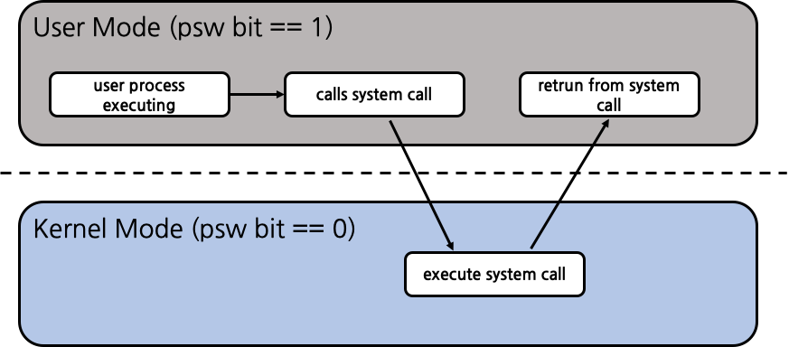
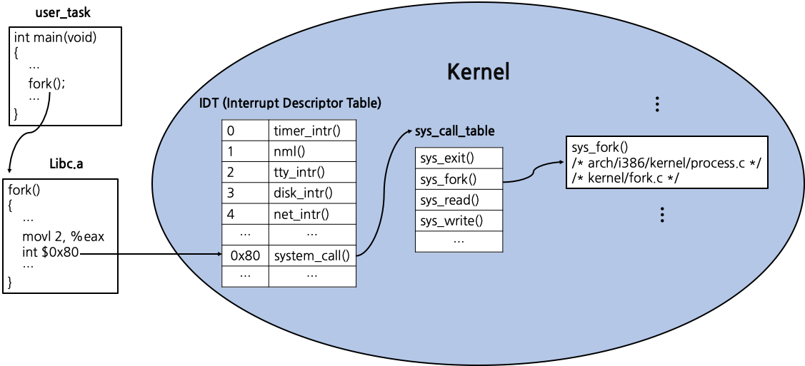

# 제한적 직접 실행 (Limited Direct Execution)

운영체제는 CPU 자원을 여러 프로세스에게 공평하게 분배하기 위해 **CPU 가상화**를 수행한다.  
이를 구현하는 대표적인 방식이 **제한적 직접 실행(Limited Direct Execution)**이다.  
하지만 이 기법을 적용하려면 몇 가지 **핵심 문제점**을 해결해야 한다.

---

## 제한적 직접 실행의 목적

1. **성능 저하 방지**: 직접 실행을 통해 오버헤드를 줄인다.
2. **운영체제의 제어 유지**: 자원 관리와 보호를 위해 OS가 제어권을 유지해야 한다.

운영체제는 프로세스를 직접 실행시키되, **제한된 범위 내에서만** 직접 실행이 가능하도록 제어한다.

---

## 제한적 직접 실행의 기본 원리

1. 사용자 프로그램은 **CPU 위에서 직접 실행**된다.
2. OS는 프로세스의 메모리를 할당하고, 실행 파일을 메모리에 적재한 뒤, 진입점(예: `main`)으로 점프한다.
3. 이후 사용자 프로그램이 실행되며, **운영체제는 통제 가능한 방식으로만介入**한다.

---

## 문제점 1: 제한된 연산 (User Mode & Kernel Mode)

사용자 프로그램이 모든 연산을 자유롭게 수행할 경우, 시스템 자원에 손상을 줄 수 있으므로 **모드 구분**이 필요하다:

- **User Mode**: 일반 연산만 수행 가능, 제한된 권한
- **Kernel Mode**: 시스템 자원 접근 및 특권 명령어 실행 가능

### 시스템 콜 흐름

1. 사용자 프로그램이 시스템 콜 요청
2. `trap` 명령어를 통해 커널 모드로 전환
3. 커널 스택에 레지스터, 플래그 등 저장
4. 트랩 핸들러가 요청한 작업 수행
5. `return-from-trap`으로 사용자 모드 복귀

> 💡 부팅 시 커널은 **트랩 테이블(trap table)**을 생성하고, 각 시스템 콜 번호에 대응하는 핸들러를 등록한다.

---

## 문제점 2: 프로세스 전환 (Context Switch)

### 1. 협조(Cooperative) 방식

- 시스템 콜이나 예외가 발생할 때만 OS가 개입
- `yield()`를 통해 CPU 반납
- ❗️문제: 프로세스가 무한 루프에 빠지면 교체 불가

### 2. 비협조(Preemptive) 방식

- 타이머 인터럽트를 통해 **강제로 CPU 회수**
- 인터럽트 발생 → 현재 프로세스 중단 → OS가 제어권 획득

### 문맥 교환 과정

1. 현재 프로세스의 레지스터 값 저장
2. PCB 상태 업데이트 (Ready, Blocked 등)
3. 다른 프로세스를 스케줄링
4. 새 프로세스의 레지스터 복원 → 실행 재개

---

## 문제점 3: 병행 실행과 인터럽트 처리

- 인터럽트 또는 트랩 도중 **새로운 인터럽트가 발생**할 수 있음
- 일반적으로 **인터럽트 비활성화(disable)**로 중첩 방지
- 단, **장시간 disable 시 인터럽트 손실 위험** 존재

운영체제는 커널 내부 자료구조를 **락(lock)**으로 보호하며 병행 실행이 가능하지만,  
**구조가 복잡해지고 동시성 버그 발생 가능성**이 있다.

---

## Mode Switch vs Process Switch

| 항목 | Mode Switch | Process Switch |
|------|-------------|----------------|
| 정의 | User ↔ Kernel 전환 | 실행 중인 프로세스 전환 |
| 연산 비용 | 낮음 | 높음 (context 저장 필요) |
| 상태 변화 | 없음 | 프로세스 상태 변경 발생 |

---

## Interrupt (인터럽트)

### 정의

- **HW Interrupt**: I/O 완료, 타이머 종료 등 외부 요인에 의한 비동기 이벤트
- **SW Interrupt**: `trap`, `system call`처럼 명령어 실행 중 발생하는 이벤트

### 처리 과정

1. 인터럽트 컨트롤러가 이벤트 감지
2. 커널의 Interrupt Descriptor Table(IDT) 참조
3. 해당 인터럽트 핸들러 함수 호출
4. User Mode → Kernel Mode 전환 후 처리 수행

---

## System Call 처리 흐름 예시: `fork()`

1. C 코드의 `fork()` 호출 → Assembly로 `MOVL` + `INT` 명령어로 변환
2. `INT`는 인터럽트 명령어이며, IDT의 시스템 콜 엔트리 참조
3. 해당 엔트리는 `sys_call_table`의 주소를 가리킴
4. `sys_fork()` 실행 → 커널 내에서 자식 프로세스 생성

### 시스템 콜 추가 절차

1. `sys_call_table`에 번호 등록
2. `syscalls.h`에 함수 원형 추가
3. C 파일에 함수 구현
4. Object 파일(.o) 생성 후 커널 경로에 저장

---

## 문맥(Context)의 3가지 종류

| 구분 | 설명 |
|------|------|
| HW 문맥 | 레지스터, 플래그 등 CPU 정보 |
| System 문맥 | 커널 스택, 시스템 콜 상태 등 |
| Memory 문맥 | 가상 주소 공간, 페이지 테이블 등 |

→ Linux의 `task_struct`에서 `mm`(메모리), `thread`(레지스터) 등의 필드로 구현됨

---

## 프로세스 전환 전체 흐름

1. `schedule()` 함수 호출 → 다음 프로세스의 PCB 결정
2. `switch(prev, next)` 호출
3. 현재 프로세스의 context 저장
4. PCB 상태 업데이트 및 큐 이동
5. 다음 프로세스 선택 및 상태 변경 (Ready → Running)
6. 다음 프로세스의 context 복원

---

## 프로세스 전환 이후 상태 예시

| 이벤트 | 전환 후 상태 |
|--------|---------------|
| `exit()` | Zombie |
| I/O 요청 | Blocked |
| Clock Interrupt | Runnable / Suspend |