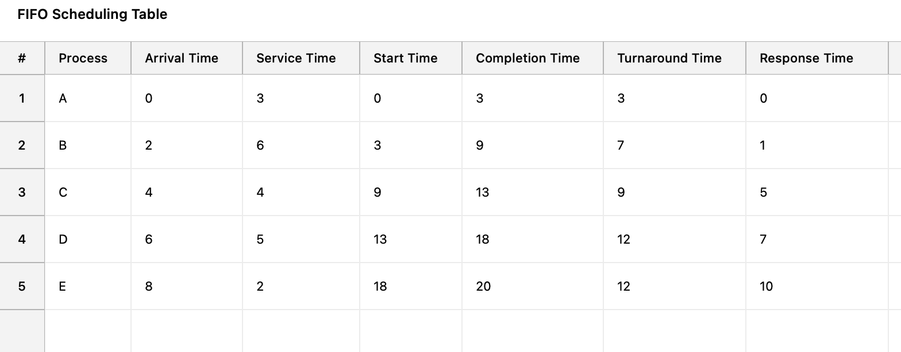
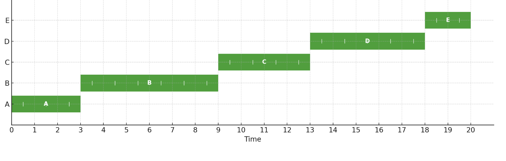
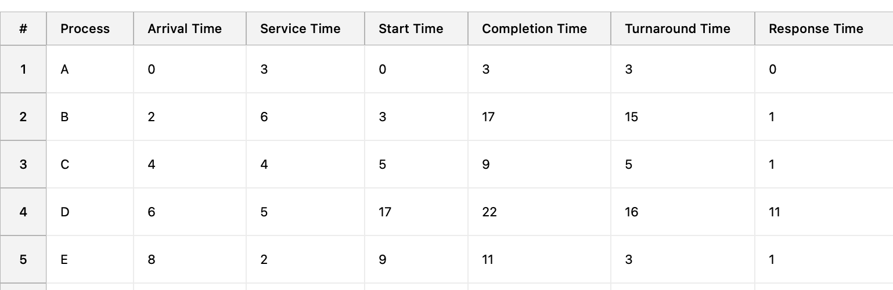
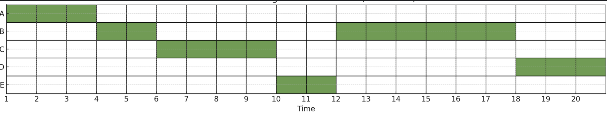
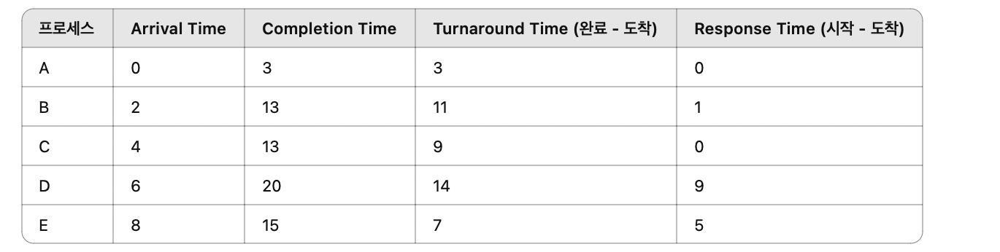
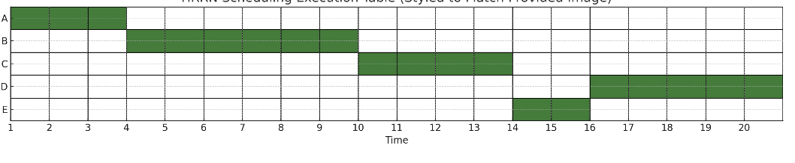
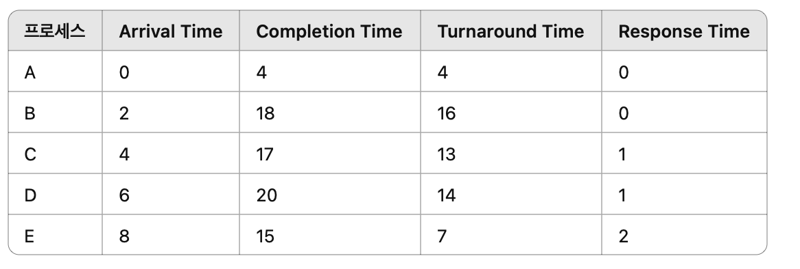
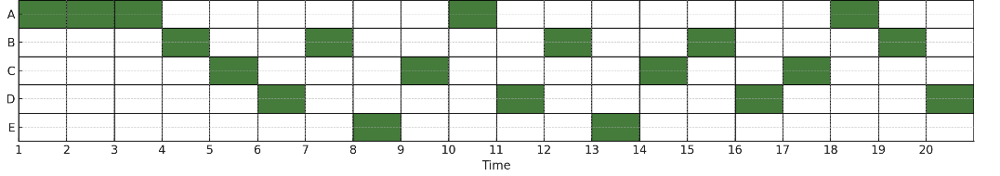
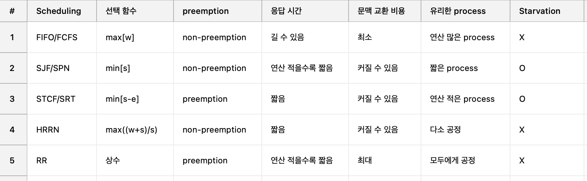

# 스케줄링 개요

workload assumptions
Workload :일련의 프로세스들이 실행하는 상황

But 가정이 비현실적이다.

- 각 작업은 동일한 시간동안 실행
- 모든 작업은 같은 시간에 도착
- 각 작업은 시작되면 완료될 때까지 실행
- 모든 작업은 CPU만 사용. I0는 없다고 가정
- 각 작업의 실행 시간은 알려져 있다고 가정

## 📌스케줄러 (장기, 단기, 중기)

- 장기(long-term) scheduling
  *process가 CPU에 의해 실행될 자격을 부여할 지를 결정*
- 중기(medium-term) scheduling
  *process(의 일부)가 Memory에 올라갈 자격을 부여할 지를 결정*
- 단기(short-term) scheduling
  *CPU에 실행될 다음 process를 선택하는 것으로, Dispatcher라고 불림*

  ## preemption vs non-preemption
- preemption(선점):

다른 process가 이미 차지하고 있던 CPU를 빼앗는 행위.

- non-preemption(비선점):

빼앗기지 않는다는 의미. 자신이 이미 CPU를 차지하고 있고 다른 process에게 넘겨주지 않는다는 것.

## 평가 기준

1. Turn around time (반환 시간)
   프로세스가 시스템에 도착한 시각부터 완료된 시각까지 걸리는 시간.

   `\text{반환 시간} = T_{\text{completion}} - T_{\text{arrival}}`
2. Response time (응답 시간)
   프로세스가 시스템에 도착한 시각부터 처음으로 CPU를 할당받아 실행되기 시작한 시각까지의 지연 시간.

   `\text{응답 시간} = T_{\text{first run}} - T_{\text{arrival}}`
3. Fairness (공정성)
   얼마나 고르게 여러 process에 cpu를 분배했느냐에 대한 척도이다. 성능과 상충되는 기준이다.

## 종류

### First In First Out (FIFO) / First Come First Service (FCFS)

🔸 개념
•	**FIFO(FCFS)**는 큐(Queue)를 기반으로 한 비선점형(non-preemptive) CPU 스케줄링 방식.
•	프로세스가 도착한 순서대로 CPU를 할당하며, 도착 시간이 빠른 프로세스가 먼저 실행.
•	따라서 대기 시간에 따라 실행 순서가 결정되고 실행 시간이 긴 프로세스가 앞에 있으면 전체 평균 응답/반환 시간이 나빠질 수 있음. (`Convoy Effect`)

ex)

✅ 평균 시간 계산
•	평균 Turnaround Time = (3 + 7 + 9 + 12 + 12) / 5 = 8.6

•	평균 Response Time = (0 + 1 + 5 + 7 + 10) / 5 = 4.6

⚠️ Convoy Effect (호위 효과)
•	FIFO의 대표적인 단점은 Convoy Effect입니다.
•	예를 들어 프로세스 E는 실행 시간이 2로 매우 짧음에도 불구하고 도착이 늦었다는 이유만으로 맨 마지막에 실행되어 전체 응답/반환 시간이 길어졌다.

예를 들어, 편의점 카운터 앞에 줄을 선 상황을 떠올려 보면
음료수 하나만 사려고 왔지만 앞 사람은 10만 원어치 물건을 결제 중입니다.
“나는 10초면 끝나는데 먼저 해주면 안 되나…” 이런 상황이 바로 Convoy Effect.

## STCF (Shortest Time-to-Completion First) SRT (Shortest Remaining Time)

🔸  개념
•	STCF는 선점형(Preemptive) 스케줄링 방식.
•	현재 실행 중인 프로세스보다 **새롭게 도착한 프로세스의 남은 실행 시간(Remain Time)**이 더 짧을 경우, 실행 중이던 프로세스를 중단하고 새로운 프로세스를 실행.

•	“남은 시간이 짧은 프로세스에게 CPU를 양보한다.”
•	현재 작업이 언제든 중단(preempt) 될 수 있다.
•	응답 시간과 반환 시간을 최소화하는 데 유리하지만, 긴 작업은 계속 밀릴 수 있는 Starvation(기아) 문제가 존재!

✅ 평균 반환 시간 (Turnaround Time)

\frac{3 + 13 + 4 + 14 + 2}{5} = \frac{36}{5} = 7.2

✅ 평균 응답 시간 (Response Time)

\frac{0 + 1 + 0 + 9 + 0}{5} = \frac{10}{5} = 2.0

⸻

•	시간 4에 프로세스 C가 도착.
•	당시 실행 중이던 B의 남은 시간은 5초, C의 전체 실행 시간은 4초.
•	따라서 C가 B를 선점(preempt) 하고 실행.
•	그 결과 C는 매우 빠르게 완료되어 낮은 반환 시간과 응답 시간을 얻게 됨.

✅ 혜택을 본 프로세스: C
❗ 손해를 본 프로세스: B (실행 중 선점당해 전체 완료가 지연)

⸻

⚠️ 단점: Starvation (기아 현상)
•	STCF는 Starvation을 해결하지 못함.
•	실행 시간이 긴 프로세스는 계속해서 짧은 작업들에게 밀려 계속 대기할 수 있다.
•	적절한 에이징(Aging) 또는 우선순위 조절이 없으면, 긴 프로세스는 끝내 CPU를 사용하지 못할 수도 있다.

## HRRN (Highest Response Ratio Next)

개념
•	HRRN은 비선점형(non-preemptive) 스케줄링 방식.
•	대기 시간과 **서비스 시간(실행 시간)**을 함께 고려하여, 우선순위를 결정.
•	SJF는 서비스 시간만 고려하고, FIFO는 도착 순서만 고려하는 반면, HRRN은 두 요소를 비율로 조합하는 방식

⸻

우선순위 계산식

**(**T**w**a**i**t+**T**s**e**r**v**i**c**e)**/**T**s**e**r**v**i**ce

대기 시간과 실행 시간을 더한 값을 대기 시간으로 나눈 값이 큰 process를 먼저 선택!

✅ 평균 반환 시간 (Turnaround Time)

\frac{3 + 11 + 9 + 14 + 7}{5} = \frac{44}{5} = 8.8

✅ 평균 응답 시간 (Response Time)

\frac{0 + 1 + 0 + 9 + 5}{5} = \frac{15}{5} = 3.0

## Round Robin (RR) / Time Slicing

개념
•	선점형(Preemptive) 스케줄링 방식.
•	프로세스들에게 **동일한 시간(Time Slice 또는 Quantum)**을 주고 순차적으로 실행.
•	각 프로세스는 큐(Queue)에 도착 순으로 들어가며, 시간 슬라이스만큼 실행된 뒤:
•	작업이 끝나지 않으면 큐의 맨 뒤로 이동
•	작업이 끝나면 큐에서 제거

Time Slice의 길이
•	너무 길면 ➡ 비선점형(FIFO/SJF)과 다를 바 없음
•	너무 짧으면 ➡ **문맥 교환(Context Switch)**이 잦아져 오버헤드 증가
•	적절한 슬라이스 선택이 성능을 좌우

예시에서는 Time Slice = 1로 설정

✅ 평균 반환 시간 (Turnaround Time)

\frac{4 + 16 + 13 + 14 + 7}{5} = \frac{54}{5} = 10.8

✅ 평균 응답 시간 (Response Time)

\frac{0 + 0 + 1 + 1 + 2}{5} = \frac{4}{5} = 0.8

## MLFQ (Multi-level Feedback Queue)

RR에서 좀 더 발전해 Time Slicing의 길이가 다른 Queue를 여러 개 운용하는 것.

## Incorporating I /O

I/O를 고려하는 scheduling. I/O 수행 중에는 CPU를 사용하지 않는다.

해당 기간 동안에 CPU를 휴식시키지 않고, 다른 process를 수행하도록 하는 것.

## 정리

