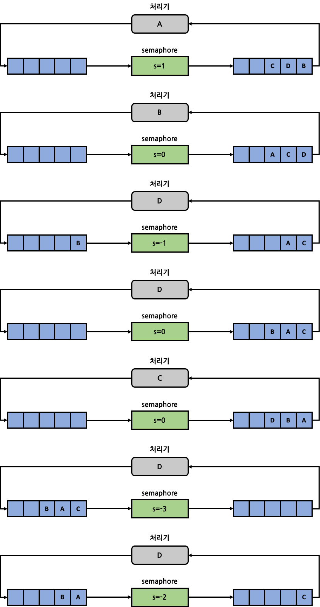

# Semaphore

Semaphore는 다수의 thread 사이의 병행성 유지를 위해 OS 단위에서 제공되는 기법입니다. 기본적인 작동 원리는 특정 thread가 특정 signal을 수신할 때까지 정해진 위치에서 wait하도록 강제하는 것입니다.

## Counting Semaphore

Counting semaphore는 정수값을 갖는 counting 변수와 3가지 연산으로 구성됩니다. 범용 semaphore라고도 불립니다.

### 기본 연산

- **semInit()**: semaphore 변수를 음이 아닌 값(대개 1)으로 초기화를 수행합니다.
- **semWait()**: semaphore 변수 값을 감소시킵니다. 만약 값이 음수가 되면 semWait()을 호출한 thread는 block됩니다. 그 외에는 해당 thread는 정상적으로 계속 수행합니다.
- **semSignal()**: semaphore 변수 값을 증가시킵니다. 만약 값이 양수가 아니면 semWait()에 의해 block된 thread 중 하나를 깨웁니다.

### 기본 구현 (Pseudo Code)

```c
typedef struct {
    int count;
    queue waitQueue;
} semaphore;

void semInit(semaphore s, int n) {
    s.count = n;
}

void semWait(semaphore s) {
    s.count--;
    if(s.count < 0) {
        // 요청한 thread를 s.waitQueue에 push
        // 요청한 thread의 상태를 block으로 변경
    }
}

void semSignal(semaphore s) {
    s.count++;
    if(s.count <= 0) {
        // s.waitQueue에서 thread 1개를 pop
        // pop한 thread의 상태를 runnable로 변경 후 OS의 readyQueue에 push
    }
}
```

> count 변수는 값이 음수인 경우에 그 절대값은 대기 queue의 길이를 의미합니다.

## Binary Semaphore (Mutex)

Mutex는 semaphore 변수가 0 또는 1의 binary 값만 갖는 semaphore를 뜻합니다. 동일하게 3가지 연산으로 구성됩니다.

### 기본 연산

- **semInitB()**: semaphore 변수를 0 또는 1로 초기화합니다.
- **semWaitB()**: semaphore 변수 값을 확인해 0일 경우 semWaitB()를 호출한 thread는 block되고, 1일 경우 값을 0으로 변경시킨 뒤 thread는 계속 수행합니다.
- **semSignalB()**: block된 thread가 있는지 확인한 후, 만약 있을 경우 해당 thread들 중 하나를 깨우고, 없을 경우 semaphore 변수 값을 1로 설정합니다.

### 기본 구현 (Pseudo Code)

```c
typedef struct {
    _Bool value;
    queue waitQueue;
} binary_semaphore;

void semInitB(binary_semaphore s, int n) {
    s.value = n;
}

void semWaitB(binary_semaphore s) {
    if(s.value == 1)
        s.value = 0;
    else {
        // 요청한 thread를 s.waitQueue에 push
        // 요청한 thread의 상태를 block으로 변경
    }
}

void semSignalB(binary_semaphore s) {
    if(s.waitQueue.empty())
        s.value = 1;
    else {
        // s.waitQueue에서 thread 1개를 pop
        // pop한 thread의 상태를 runnable로 변경 후 OS의 readyQueue에 push
    }
}
```

Binary semaphore는 일반 범용 semaphore에 비해 구현이 간단하다는 장점이 있습니다. 둘 모두 waitQueue를 운용한다는 점에서 공통적입니다.

## Strong / Weak Semaphore

- **강성(Strong) Semaphore**: Queue에서 FIFO 방식을 사용하는 semaphore
- **약성(Weak) Semaphore**: 특별히 queue의 순서를 명시하지 않은 semaphore

대부분의 OS에서는 강성 semaphore를 사용합니다. Starvation이 없고, 직관적이며 구현하기도 용이하기 때문입니다.

아래는 강성 semaphore의 예시입니다. D thread는 생산자, A, B, C thread는 소비자인 문제입니다. 초기 semaphore 변수 s가 값이 1로 시작됩니다.

> s의 값이 음수일 때에는 그 절댓값이 기다리는 thread의 개수(waitQueue 내 thread의 개수)를 뜻하고, s의 값이 음수가 아닐 때에는 생산자가 생성한 자원의 여분 개수를 뜻합니다.



## Mutual Exclusion Problem

범용 semaphore를 사용해 상호 배제 문제를 해결해봅시다. 상호 배제 문제란 동일한 자원에 접근하려는 n개의 thread의 병행성을 처리하는 문제입니다.

semInit()에서 count 변수를 0이 아닌 변수로 초기화합니다. count 변수의 초기값은 자원의 개수를 의미합니다. 따라서 count 변수는 0으로 초기화 되어서는 안됩니다. 모든 thread가 무한히 block될 것이기 때문입니다.

각 thread에서 critical section(임계 영역)을 생성하게 되는데, critical section이란 한 번에 최대 1개의 thread만이 접근할 수 있는 영역입니다. semWait()~semSignal() 사이의 영역이 됩니다.

### 구현 (Pseudo Code)

```c
semaphore s;

void thread_execute(int thread_no) {
    while(1) {
        semWait(s);
        // 임계 영역
        semSignal(s);
        // 임계 영역 이후
    }
}

int main(void) {
    semInit(s, 1);
    for(int i = 0; i < num_of_threads; i++)
        thread_start(i);
}
```

Thread가 1, 2, 3 순서대로 실행된다고 가정했을 때 각 thread는 아래와 같은 형태로 실행됩니다:


## Producer-Consumer Problem

생산자-소비자 문제를 mutex를 이용해 해결해봅시다. 생산자-소비자 문제는 다수의 생산자 thread가 각자 자원을 생성해 공용 buffer에 저장하고, 다수의 소비자 thread가 공용 buffer에서 자원을 1개씩 소비하는 상황의 병행성을 처리하는 문제입니다.

공용 buffer에는 한 번에 1개의 thread만 접근 가능하다(critical section)는 조건이 있습니다. 우선 공용 buffer가 무한한 크기를 갖는다고 가정합니다.

이 때 in과 out이라는 pointer 변수를 사용하는데, in은 다음에 생산자가 생성한 자원이 저장될 buffer에서의 위치이며, out은 다음에 소비자가 소비할 자원이 저장된 buffer에서의 위치입니다. 따라서 out<in인 경우에만 소비자가 소비할 자원이 있는 것입니다.

### 기본 구현 (Pseudo Code)

```c
int n;                     // in-out의 값
binary_semaphore s;        // buffer의 접근을 제어하는 mutex
binary_semaphore delay;    // buffer가 비었는지를 확인해 소비를 제어하는 mutex

void producer(void) {
    while(1) {
        val = produce();       // 자원 생산
        semWaitB(s);
        /*
            critical section start
        */
        append(val);           // buffer에 push
        n++;
        if (n == 1)            // buffer.empty()==false가 된 상황
            semSignalB(delay);   // consumer 중 1개 block 해제
        /*
            critical section end
        */
        semSignalB(s);
    }
}

void consumer(void) {
    // consumer가 producer보다 먼저 실행되는 상황(buffer.empty()==true)를 막기 위해 block
    semWaitB(delay);
    while(1) {
        semWaitB(s);
        /*
            critical section start
        */
        val = take();        // buffer에서 pop
        n--;
        /*
            critical section end
        */
        semSignalB(s);
        consume(val);       // 자원 소비
        if(n == 0)          // buffer.empty()==true가 된 상황
            semWaitB(delay); // thread block
    }
}

int main(void) {
    n = 0;
    semInitB(s, 1);
    semInitB(delay, 0);
    for(int i = 0; i < num_of_producers; i++)
        thread_start(i);
    for(int i = 0; i < num_of_consumers; i++)
        thread_start(i);
}
```

위의 코드는 producer와 consumer 내의 while문이 매 번 atomic하게 전체가 함께 실행되면 정상적으로 작동할 것입니다. 하지만 while loop가 1번 도는 사이에 scheduling이 발생하지 않을 것이라는 보장이 없습니다.

만약 consumer에서 semSignalB(s)와 if(n==0) 사이에서 scheduling이 발생해 producer가 실행된다면 n은 0에서 1로 변경될 것이고, 그렇다면 다시 scheduling이 되어 consumer로 돌아왔을 때 if(n==0)을 만족하지 못하므로 semWaitB(delay)가 실행되지 않을 것입니다.

이는 소비자가 한 개의 thread라면 큰 문제가 되지 않지만, 다수의 thread일 경우에는 문제 상황이 됩니다. Empty임에도 여러 소비자 thread 모두 block되지 않을 수 있기 때문입니다.

### Solution 1: 보조 변수 사용

```c
int n;                     // in-out의 값
binary_semaphore s;        // buffer의 접근을 제어하는 mutex
binary_semaphore delay;    // buffer가 비었는지를 확인해 소비를 제어하는 mutex

void producer(void) {
    while(1) {
        val = produce();       // 자원 생산
        semWaitB(s);
        /*
            critical section start
        */
        append(val);           // buffer에 push
        n++;
        if (n == 1)            // buffer.empty()==false가 된 상황
            semSignalB(delay);   // consumer 중 1개 block 해제
        /*
            critical section end
        */
        semSignalB(s);
    }
}

void consumer(void) {
    int m;  // 보조 변수
    // consumer가 producer보다 먼저 실행되는 상황(buffer.empty()==true)를 막기 위해 block
    semWaitB(delay);
    while(1) {
        semWaitB(s);
        /*
            critical section start
        */
        val = take();        // buffer에서 pop
        n--;
        m = n;  // 현재 n값 저장
        /*
            critical section end
        */
        semSignalB(s);
        consume(val);       // 자원 소비
        if(m == 0)          // buffer.empty()==true가 된 상황
            semWaitB(delay); // thread block
    }
}

int main(void) {
    n = 0;
    semInitB(s, 1);
    semInitB(delay, 0);
    for(int i = 0; i < num_of_producers; i++)
        thread_start(i);
    for(int i = 0; i < num_of_consumers; i++)
        thread_start(i);
}
```

n의 값이 변경되는 것을 막기 위해 critical section 내에서 보조 변수 m에 현재 n의 값을 임시로 저장합니다. 이후 critical section 밖의 if문에서 n 대신 m이 0인지를 확인하게 됩니다.

### Solution 2: 범용 Semaphore 사용

Binary semaphore가 아닌 범용 semaphore를 사용하면 애초에 위의 문제 상황이 발생하지 않습니다.

```c
semaphore s;               // buffer의 접근을 제어하는 semaphore
semaphore n;               // buffer에 들어있는 자원의 개수를 제어하는 semaphore

void producer(void) {
    while(1) {
        val = produce();       // 자원 생산
        semWait(s);
        /*
            critical section start
        */
        append(val);           // buffer에 push
        semSignal(n);          // consumer 중 1개 block 해제
        /*
            critical section end
        */
        semSignal(s);
    }
}

void consumer(void) {
    while(1) {
        semWait(n);          // buffer.empty()==true일 때 실행되는 것을 방지하기 위해 block
        semWait(s);
        /*
            critical section start
        */
        val = take();        // buffer에서 pop
        /*
            critical section end
        */
        semSignal(s);
        consume(val);       // 자원 소비
    }
}

int main(void) {
    semInit(s, 1);
    semInit(n, 0);
    for(int i = 0; i < num_of_producers; i++)
        thread_start(i);
    for(int i = 0; i < num_of_consumers; i++)
        thread_start(i);
}
```

공용 변수 n과 delay를 통합해 하나의 범용 semaphore n으로 운용합니다. n의 값에 따라 delay를 wait 또는 signal하지 않고 무조건적으로 producer에서는 semSignal(n), consumer에서는 semWait(n)하게 됩니다.

n은 buffer에 들어가 있는 자원의 개수(음수일 경우 그 절댓값은 waitQueue에 들어있는 thread의 수)임과 동시에 thread의 실행 순서를 제어하는 역할을 하게 됩니다.

Consumer thread들은 매 번 실행될 때마다 semWait(n)을 하게 됩니다. 따라서 producer에서 semSignal(n)과 semSignal(s)가 서로 순서가 바뀌어 semSignal(n)이 critical section 밖에서 수행된다고 하더라도 동일하게 실행됩니다. 왜냐하면 어차피 consumer들은 semWait(n)을 통해 block된 상태이기에 semSignal(n)이 호출되어야 수행될 수 있기 때문입니다.

## 유한 Buffer 사용

위의 모든 솔루션은 무한한 buffer를 사용한다는 가정 하에서 이루어졌습니다. 하지만 실제로 무한한 buffer는 존재하지 않으므로 유한한 buffer를 사용하게 됩니다. 대개 circular queue를 사용하게 됩니다.

```c
semaphore s;               // buffer의 접근을 제어하는 semaphore
semaphore n;               // buffer에 들어있는 자원의 개수를 제어하는 semaphore
semaphore b;               // 유한 buffer를 관리하는 semaphore

void producer(void) {
    int val;
    while(1) {
        val = produce();       // 자원 생산
        semWait(b);            // buffer.full()==true일 경우 block
        semWait(s);
        /*
            critical section start
        */
        append(val);           // buffer에 push
        semSignal(n);          // consumer 중 1개 block 해제
        /*
            critical section end
        */
        semSignal(s);
    }
}

void consumer(void) {
    int val;
    while(1) {
        semWait(n);          // buffer.empty()==true일 때 실행되는 것을 방지하기 위해 block
        semWait(s);
        /*
            critical section start
        */
        val = take();        // buffer에서 pop
        /*
            critical section end
        */
        semSignal(s);
        semSignal(b);        // buffer.full()==false이므로 block된 producer 중 1개 unblock
        consume(val);        // 자원 소비
    }
}

int main(void) {
    semInit(s, 1);
    semInit(n, 0);
    semInit(b, BUFFER_SIZE);
    for(int i = 0; i < num_of_producers; i++)
        thread_start(i);
    for(int i = 0; i < num_of_consumers; i++)
        thread_start(i);
}
```

## 순서 보장을 위한 세마포어

세마포어는 사건들의 순서를 정하는데도 유용합니다. 컨디션 변수를 사용했던 것과 유사하게 세마포어를 순서를 위한 도구로 사용할 수 있습니다.

### 부모-자식 프로세스 동기화 예제

```c
sem_t s;

void *child(void *arg) {
    printf("child\n");
    sem_post(&s); // 자식 프로세스 종료 신호
    return NULL;
}

int main(int argc, char *argv[]) {
    sem_init(&s, 0, 0); // 세마포어 초기값 0으로 설정
    printf("parent: begin\n");
    
    pthread_t c;
    pthread_create(&c, NULL, child, NULL);
    
    sem_wait(&s); // 자식 종료 대기
    printf("parent: end\n");
    return 0;
}
```

이 예제에서 부모 프로세스는 자식 프로세스를 생성 후 `sem_wait()` 호출하여 자식 종료를 대기하고, 자식은 `sem_post()` 호출하여 종료를 알립니다. 세마포어 초기값은 0으로 설정되어 있어 부모가 대기 상태에 들어갑니다.

## Reader-Writer 락

다수의 쓰레드가 연결 리스트와 같은 자료구조에 노드를 삽입하고 검색하는 상황에서 사용하기 위해 만들어진 락입니다.

### 주요 특징

- **읽기 쓰레드**: 여러 읽기 쓰레드가 동시에 락을 획득할 수 있습니다.
- **쓰기 쓰레드**: 쓰기 쓰레드는 배타적 접근권한을 가지며, 읽기 쓰레드와 동시에 접근할 수 없습니다.

### 구현 예제

```c
typedef struct _rwlock_t {
    sem_t lock;      // 전체 락
    sem_t writelock; // 쓰기 락
    int readers;     // 현재 읽는 쓰레드 수
} rwlock_t;

void rwlock_init(rwlock_t *rw) {
    rw->readers = 0;
    sem_init(&rw->lock, 0, 1);
    sem_init(&rw->writelock, 0, 1);
}

void rwlock_acquire_readlock(rwlock_t *rw) {
    sem_wait(&rw->lock);
    rw->readers++;
    if (rw->readers == 1) // 첫 번째 reader면 writelock 획득
        sem_wait(&rw->writelock);
    sem_post(&rw->lock);
}

void rwlock_release_readlock(rwlock_t *rw) {
    sem_wait(&rw->lock);
    rw->readers--;
    if (rw->readers == 0) // 마지막 reader면 writelock 해제
        sem_post(&rw->writelock);
    sem_post(&rw->lock);
}

void rwlock_acquire_writelock(rwlock_t *rw) {
    sem_wait(&rw->writelock);
}

void rwlock_release_writelock(rwlock_t *rw) {
    sem_post(&rw->writelock);
}
```

### 공정성 문제

이 구현은 쓰기 쓰레드에게 기아 현상이 발생하기 쉽습니다. 읽기 쓰레드가 계속해서 도착하면 쓰기 쓰레드는 영원히 락을 획득하지 못할 수 있습니다.

이를 해결하기 위해서는 쓰기 쓰레드가 대기 중일 때 읽기 쓰레드가 락을 획득하지 못하도록 해야 합니다.

## 식사하는 철학자

다섯 명의 철학자가 식탁 주위를 둘러 앉았고, 총 다섯 개의 포크가 철학자 사이에 하나씩 놓여있는 문제입니다. 철학자는 양쪽의 포크를 들어야 식사를 할 수 있습니다.

### 교착 상태 문제

모든 철학자가 동시에 왼쪽 포크를 집으면 오른쪽 포크를 기다리게 되어 교착 상태가 발생합니다.

### 해결책

```c
int left(int p) { return p; }
int right(int p) { return (p + 1) % 5; }

sem_t forks[5];

void get_forks(int p) {
    if (p == 4) {
        // 마지막 철학자만 오른쪽 포크부터 집도록 변경
        sem_wait(&forks[right(p)]);
        sem_wait(&forks[left(p)]);
    } else {
        sem_wait(&forks[left(p)]);
        sem_wait(&forks[right(p)]);
    }
}

void put_forks(int p) {
    sem_post(&forks[left(p)]);
    sem_post(&forks[right(p)]);
}
```

이 해결책은 한 명의 철학자(여기서는 마지막 철학자)가 오른쪽 포크부터 집게 함으로써 교착 상태를 방지합니다.

## 쓰레드 제어

과하게 많은 쓰레드가 동시에 수행되면 효율이 나빠지는 현상을 방지하기 위해 세마포어를 사용하여 쓰레드 개수를 제한할 수 있습니다.

### 제어(Throttling) 기법

```c
sem_t throttle;

void *memory_intensive_thread(void *arg) {
    sem_wait(&throttle);
    
    // 메모리 집약적 작업 수행
    
    sem_post(&throttle);
    return NULL;
}

int main(int argc, char *argv[]) {
    // 최대 동시 실행 쓰레드 수를 MAX_THREADS로 제한
    sem_init(&throttle, 0, MAX_THREADS);
    
    // 쓰레드 생성 및 실행
    
    return 0;
}
```

이러한 접근법을 제어(throttling)라고 하며 수락 제어의 한 형태로 간주합니다. 세마포어의 값을 메모리-집약 영역에 동시에 들어갈 수 있는 최대 쓰레드 개수로 초기화하고, `sem_wait()`와 `sem_post()`를 각각 추가하면서 쓰레드 개수를 통제합니다.

## 세마포어 구현

락과 컨디션 변수를 사용하여 세마포어인 제마포어(Zemaphore)를 구현할 수 있습니다.

```c
typedef struct __Zem_t {
    int value;
    pthread_cond_t cond;
    pthread_mutex_t lock;
} Zem_t;

void Zem_init(Zem_t *s, int value) {
    s->value = value;
    Cond_init(&s->cond);
    Mutex_init(&s->lock);
}

void Zem_wait(Zem_t *s) {
    Mutex_lock(&s->lock);
    while (s->value <= 0)
        Cond_wait(&s->cond, &s->lock);
    s->value--;
    Mutex_unlock(&s->lock);
}

void Zem_post(Zem_t *s) {
    Mutex_lock(&s->lock);
    s->value++;
    Cond_signal(&s->cond);
    Mutex_unlock(&s->lock);
}
```

이 구현에서는 세마포어의 값이 0 이하인 경우 `Zem_wait()`을 호출한 쓰레드는 값이 증가할 때까지 대기합니다. `Zem_post()`는 세마포어 값을 증가시키고 대기 중인 쓰레드 하나를 깨웁니다.

### 실제 세마포어와의 차이점

위 구현은 `wait()` 함수에서 세마포어 값이 감소하기 전에 먼저 확인하도록 되어 있습니다. 실제 POSIX 세마포어는 값이 감소한 다음에 확인하여 음수 값을 가질 수 있으며, 이 값은 대기 중인 쓰레드 수를 나타냅니다.

## 요약

세마포어는 병행 프로그램 작성을 위한 강력하고 유연한 기법입니다. 락과 컨디션 변수의 기능을 모두 가지면서도 더 간단한 인터페이스를 제공합니다. 다양한 동기화 문제를 해결하는데 매우 효과적으로 사용될 수 있습니다. 